# Lessons Learned: CI Setup

This document captures the lessons learned during the CI setup process to help future contributors avoid similar issues.

## Issue 1: Missing Dependencies

**Problem:** `ModuleNotFoundError: No module named 'strands'`

**Cause:** The package name was incorrect. Used `strands` instead of `strands-agents`.

**Solution:** Updated `pyproject.toml`:
```toml
dependencies = [
    # ... other deps ...
    "strands-agents[ollama,litellm]>=1.0.0",
    "strands-agents-tools>=0.2.0",
]
```

**Lesson:** Always verify the exact package names in PyPI before adding dependencies.

---

## Issue 2: API Costs in CI

**Problem:** Original CI design made expensive API calls to OpenRouter on every commit.

**Cause:** E2E tests were making real LLM API calls without mocking.

**Solution:** 
- Removed all real API calls from CI
- Created mocked integration tests
- Moved E2E tests to optional manual script

**Lesson:** **Mock external dependencies in CI!** 
- CI should be fast, free, and reliable
- Save real API testing for manual verification

---

## Issue 3: Token Limit Exceeded

**Problem:** `BadRequestError: This endpoint's maximum context length is 131072 tokens. However, you requested about 142259 tokens...`

**Cause:** Wikipedia articles were too large (2 articles × 2000 chars each)

**Solution:** Reduced limits:
```yaml
wikipedia:
  max_articles: 1        # Down from 2
  max_chars_per_article: 800  # Down from 2000
```

**Lesson:** When testing with real APIs, keep queries minimal to reduce costs and avoid limits.

---

## Issue 4: Authentication Errors in Mocked Tests

**Problem:** `httpx.HTTPStatusError: Client error '401 Unauthorized'`

**Cause:** Tests were partially mocked - model creation was mocked, but Agent instantiation was trying to make real API calls.

**Solution:** Mock the `create_model_from_config` function:
```python
with patch('src.agent.create_model_from_config') as mock_create_model:
    mock_model = Mock()
    mock_create_model.return_value = mock_model
    # Now agent initialization won't need credentials
    agent = WikipediaAgent(config)
```

**Lesson:** When mocking, trace through the entire code path to ensure ALL external calls are mocked.

---

## Issue 5: Async Iteration Error

**Problem:** `'async for' requires an object with __aiter__ method, got Mock`

**Cause:** Mocked the wrong object. The code creates a NEW Agent instance in `_sync_query()`, so mocking the original `agent.agent` instance didn't work.

**Solution:** Mock the Agent CLASS, not just an instance:
```python
# ❌ Wrong - only mocks the first agent instance
with patch.object(agent.agent, '__call__', ...):

# ✅ Correct - mocks all Agent instantiations
with patch('src.agent.Agent') as MockAgent:
    mock_agent_instance = Mock()
    mock_agent_instance.return_value = Mock(output="...")
    MockAgent.return_value = mock_agent_instance
```

**Lesson:** Understand the code flow! If code creates new instances, mock the class constructor, not existing instances.

---

## Issue 6: Not Testing Locally First

**Problem:** Pushed code to CI without verifying locally, causing multiple iterations to fix issues.

**Cause:** No local testing workflow established.

**Solution:** Created `run_ci_tests_locally.sh` script:
```bash
./run_ci_tests_locally.sh  # Run before pushing!
```

**Lesson:** **ALWAYS test CI changes locally first!**
- Faster iteration
- No wasted CI minutes
- No broken builds on main branch

---

## Best Practices Established

### ✅ DO:
1. **Mock ALL external dependencies** in CI tests
2. **Test locally** before pushing CI changes
3. **Keep API tests manual** to control costs
4. **Mock at the right level** (classes vs instances)
5. **Document costs** for any paid operations
6. **Use small test data** to minimize tokens/time

### ❌ DON'T:
1. Don't make real API calls in CI
2. Don't assume mocking is complete without testing
3. Don't use large datasets in tests
4. Don't mock individual instances when code creates new ones
5. Don't skip local testing "to save time"
6. Don't require credentials for CI tests

---

## Testing Workflow

The correct workflow for any code change:

```mermaid
graph TD
    A[Make Code Change] --> B[Run Unit Tests Locally]
    B --> C{Tests Pass?}
    C -->|No| A
    C -->|Yes| D[Run Integration Tests Locally]
    D --> E{Tests Pass?}
    E -->|No| A
    E -->|Yes| F[Optional: Run Manual E2E]
    F --> G[Commit & Push]
    G --> H[CI Runs Automatically]
    H --> I{CI Pass?}
    I -->|No| A
    I -->|Yes| J[Done! 🎉]
```



Commands:
```bash
# 1. Unit tests
pytest tests/ -v

# 2. Integration tests (mocked)
python3 test_integration_mocked.py

# 3. Optional: E2E with real API (~$0.01)
python3 test_e2e_manual.py

# 4. Or run all CI tests together
./run_ci_tests_locally.sh

# 5. Push when all pass
git push
```

---

## Cost Analysis

| Test Type | Cost | Time | Frequency |
|-----------|------|------|-----------|
| Unit tests | $0 | 10s | Every commit |
| Integration (mocked) | $0 | 5s | Every commit |
| Manual E2E | ~$0.01 | 30s | Before release |
| **Total CI cost** | **$0** | **15s** | **Automatic** |

**Annual savings from mocking:** ~$500-1000
(Assuming 100 commits/month × $0.02/run × 12 months = $240-480)

---

## Files Created

1. `.github/workflows/tests.yml` - CI workflow (mocked tests only)
2. `test_integration_mocked.py` - Integration tests with no API calls
3. `test_e2e_manual.py` - Manual E2E tests with real API
4. `run_ci_tests_locally.sh` - Local test runner
5. `TESTING.md` - Comprehensive testing guide
6. `.github/CI_SETUP.md` - CI documentation
7. `.github/LESSONS_LEARNED.md` - This file

---

## Future Improvements

- [ ] Add pre-commit hooks to run tests automatically
- [ ] Add linting (ruff, black) to CI
- [ ] Add type checking (mypy) to CI
- [ ] Cache dependencies in CI for faster runs
- [ ] Add performance regression testing
- [ ] Matrix testing across Python versions

---

## Key Takeaway

> **"Mock everything in CI. Test with real APIs manually."**

This approach gives you:
- ✅ Fast CI (< 2 minutes)
- ✅ Free CI ($0 per run)
- ✅ Reliable CI (no API flakiness)
- ✅ Confidence in real behavior (manual E2E)
- ✅ Control over costs (you decide when to spend)
